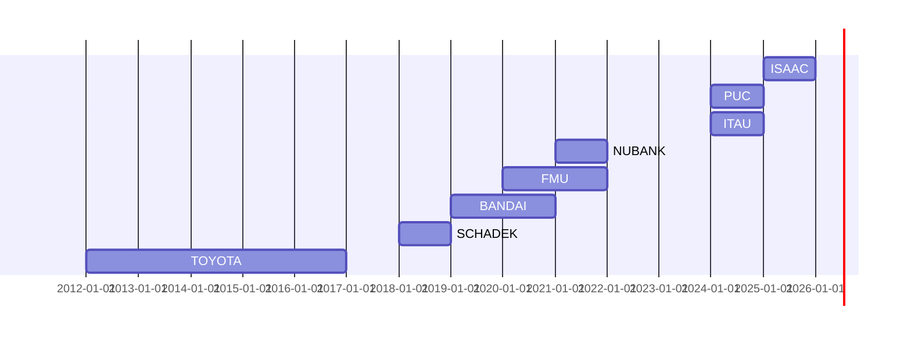

<pre>
██████╗ ███╗   ███╗██╗   ██╗███████╗ █████╗  ██████╗██╗  ██╗██╗ ██████╗ 
██╔══██╗████╗ ████║██║   ██║██╔════╝██╔══██╗██╔════╝██║  ██║██║██╔═══██╗
██████╔╝██╔████╔██║██║   ██║███████╗███████║██║     ███████║██║██║   ██║
██╔═══╝ ██║╚██╔╝██║██║   ██║╚════██║██╔══██║██║     ██╔══██║██║██║   ██║
██║     ██║ ╚═╝ ██║╚██████╔╝███████║██║  ██║╚██████╗██║  ██║██║╚██████╔╝
╚═╝     ╚═╝     ╚═╝ ╚═════╝ ╚══════╝╚═╝  ╚═╝ ╚═════╝╚═╝  ╚═╝╚═╝ ╚═════╝ 
D A T A   S C I E N T I S T   |   A I   E N G I N E E R
</pre>
  

     
       

## About

 

Profissional com experiência no NUBANK, ITAÚ e TOYOTA

Trabalho no desenvolvimento de produtos de dados visando retorno financeiro mensurável, desde a engenharia analítica até modelos de Machine Learning

Atualmente aprimorando habilidades em **Generative AI** aplicadas à inovação e eficiência de negócios

 

 

## Skills

| Area | Competencies |
| :--- | :--- |
| **Predictive Modeling** | Classification, Quantile Regression, Outlier Detection, Handling imbalanced data & selection bias. |
| **Time Series** | Forecasting (Nixtla), Analysis of temporal components, Seasonality & Exogenous variables. |
| **XAI & Uncertainty** | Conformal Prediction, SHAP, Permutation Importance. |
| **MLOps** | MLflow, Optuna (Hyperparameter tuning), Behavioral testing, Out-of-Time/Sample validation. |

 

## Main Projects

| Project | Description |
| :--- | :--- |
| **Predicting Churn** | *Classification model for Fintech customer retention.* |
| **Singapore House Pricing** | *Regression analysis for real estate market.* |
| **Brazil Inflation** | *Time Series forecasting for economic indicators.* |
| **Loan Default Probability** | *Risk classification model for credit scoring.* |

  

